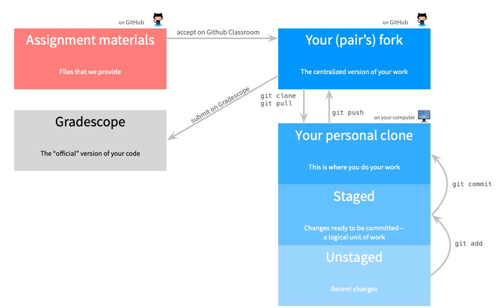

```{r setup, include=FALSE}
options(htmltools.dir.version = FALSE)
```

# A Typical Week 

A "typical" week in the course will proceed in the following way: 

## 1. Before Live Session

Complete all async materials. This means: 

- Watch all lectures 
- Complete all readings 
- Work through all concept checks 

## 2. In Live Session 

We will work on exercises and coding that will extend your understanding.  

## 3. After Live Session 

Complete the homework for the unit. This homework will be due before the next live session. 

---

# Resources 

You will use these resources most frequently. 

- [bCourses](http://bcourses.berkeley.edu) [CalNet Auth]
- [Github Org](http://github.com/mids-w203) [Your GitHub Auth]
- [Slack](ucbischool.slack.com): Join channel `#datasci-203-<year>-<semester>` [Your ISchool Auth]
- [Gradescope](https://www.gradescope.com) [Auth from bCourses]
- [University Library VPN](https://www.lib.berkeley.edu/using-the-libraries/) [CalNet Auth]

---

# Course Language: R 

- We will be providing all code for the course in `.Rmd` files. 
  - We continue to assess the software landscape, and continue to believe that this form of descriptive and inferrential statistics is most easily handled in R (rather than, python+scipy, julia)
  - Dealing with data, conducting stats, plotting and building reports. 
  - We (your instructors) all work across languages

---
class: inverse, center, middle

# Software and Computing 

---

#Software and Computing 
## R DataHub

- For much of the work that you do in the course, you can use the UC Berkeley provided [R Datahub](http://ischool.datahub.berkeley.edu) instance. 
  - This is a small instance, but for a lot of the exercises we do it will be sufficient. 
  - This resource has ephemeral compute (i.e. when you log-off your "state" will not be saved); 
  - But, persistent storage (i.e. what you save will be available for you when you return). 

---
# Software and Computing
## Docker 
- For larger projects that you want to work on, we'd suggest using a Docker image that has solved all of the dependencies. 
- Several great images are maintained by the Rstudio group and are available at [Rocker Docker Hub](https://hub.docker.com/u/rocker). In particular, the `rocker/rstudio`, `rocker/tidyverse`, and `rocker/verse` images are go-to images. 
- You can _always_ build on top of an image, to install smaller libraries that you need.

--- 

- This solution is relatively straightforward for users on machines that are running a version of either Linux and Unix (i.e. Apple)
- The solution is workable for users on machines that are running a [_very_](https://docs.docker.com/docker-for-windows/install/) recent version of a Microsoft OS. 

---
class: inverse, center, middle

# Homework

---

# Homework 

- There are individual homework assigments in the course. 
- We are providing resources via GitHub, which means to access these resources, you need to _clone_ them to your computer.  
- _To clone_:
  - On our GitHub Org:  
    - Copy the _Clone_ link.  
  - On your machine that you will be using to do your work, in the terminal: 
    - Issue the command `git clone <the link you just copied>` 
    - Open the `unit_01` homework folder
- _To submit the first homework_
  - Navigate to bCourses > Assignments > Homework
  - Upload scans of your homework to each appropriate question. 
  
---

# Visual of Homework


(From `https://hmc-cs-131-spring2020.github.io/howtos/assignments.html`)

---
class: inverse, center, middle

# Recommendations for Learning

---

# Recommendations for Learning
## Proceed step-by-step.
- Each concept builds on previous concepts.
- When we call out a reading section in the async, read it then, so that the accompanying lecture comes fits in with your learning process. 
  - We have interwoven reading and video to help you master each concept before moving on.
- By integrating reading and video, we can integrate, explain, and set the location of what you're going to read of have just read. 
- We know that this is probably different from any class you've taken before; but, that's because in an online format like this we're not bound by the same constraints as when we have to be in person. 
- In this format we're optimizing for maximum learning, not ease of scheduling.

---

# Recommendations for Learning 
## Build a schedule for your studying.

- Find time when you feel calm and can focus on the material.
- If possible, we recommend splitting your study time over multiple days.
  - We have divided most units into "parts" for this purpose.
  - It is **really** challenging to be highly engaged for more than 1.5 hours. 
  - For those who have been out of school for a while, you may be "out of shape" in your learning. 
  
---

# Recommendations for Learning 
## Study together.

- Schedule study sections
- Schedule peer discussion sections
- Schedule Q&A times about homework with your peers. 

> **You all** -- *the community of students* -- **are the best resource in the program.**

---

# Recommendations for Learning 
## Attend Office Hours.

- You can attend the office hours of any instructor.
- You can attend the office hours of any TA. 
- You can attend as many office hours each week as you want.
- In the early weeks, office hours will work through an example problem for the first ~30 minutes, then address questions. 
- Bring your homework problems, or more general questions, or show up just to chat.

---

# Recommendations for Learning
## Maximize learning, not points.
- There's no reason to score points on assignments or tests if you haven't learned the concept.
- The fundamentals will be important throughout MIDS and beyond.

---

- The process of moving from real-world problem setup into the constrained math objects and back is *a huge part of what creates value as a data scientist*. 
- Interviews focus on this because data scientist's work focuses on this. 
  - We don't ask "plug-and-chug" problems in assessments for this course.
  - Instead, the skill is in connecting the world and its complexities to mathematical objects. 
  - It's normal not to know what formula to apply; what step to take with a proof; or whether this answer is correct. 
  - If you knew the formula, step, or solution, it wouldn't be a problem worth solving! 
  - If you feel lost, try drawing a picture, start by defining variables, and try to express the concept you want to find in terms of those variables. 